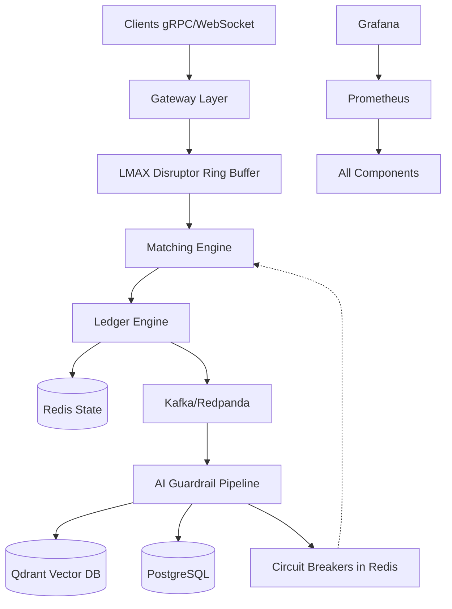

# AeroRisk AI

**Low-Latency Distributed Transaction Engine with Multi-Agent AI Risk Orchestration**

---

## Overview

AeroRisk AI is a production-grade distributed financial transaction platform engineered for ultra-low latency and high throughput. It combines a Go-based matching engine with a Python-based multi-agent AI risk orchestration system to provide real-time fraud detection, compliance enforcement, and circuit-breaker controls.

### Key Capabilities

- **>100k TPS** sustained throughput
- **<1ms p99** matching latency
- **Async AI** fraud/compliance orchestration (<200ms)
- **Real-time circuit-breaker** enforcement
- **Full observability** with Prometheus, Grafana, and OpenTelemetry
- **Complete auditability** with immutable audit logs

---

## Architecture

### System Diagram



### Fast Path (Go)

The high-performance execution path built with Go:

| Component | Description |
|-----------|-------------|
| **Gateway Layer** | gRPC + WebSocket servers with authentication and rate limiting |
| **LMAX Disruptor** | Lock-free ring buffer for zero-copy event passing |
| **Matching Engine** | Price-time priority order matching with RB-tree optimization |
| **Ledger Engine** | Double-entry bookkeeping with atomic settlement |
| **Kafka Publisher** | Async event streaming to AI pipeline and audit logs |
| **Redis Circuit Breakers** | Sub-millisecond risk state enforcement |

### AI Path (Python)

Multi-agent LangGraph pipeline for risk orchestration:

| Agent | Responsibility | Latency Target |
|-------|---------------|----------------|
| **Agent 1** | Anomaly Detection (velocity, VWAP, wash trade, spoofing) | <50ms |
| **Agent 2** | RAG + Compliance Retrieval (rules, sanctions, news, profiles) | <100ms |
| **Agent 3** | LLM Decision Orchestrator (risk scoring, actions, incident reports) | <50ms |

### Data Stores

| Store | Purpose | Technology |
|-------|---------|------------|
| **Redis** | Account state, circuit breakers, hot cache | Redis 7.x |
| **Qdrant** | Vector embeddings for compliance & anomaly search | Qdrant 1.x |
| **PostgreSQL** | Incident reports, audit metadata | PostgreSQL 15+ |
| **S3/Parquet** | Immutable audit logs, historical analytics | S3-compatible |

### Observability Stack

- **Prometheus**: Metrics collection with custom histograms for latency
- **Grafana**: Real-time dashboards for TPS, latency, error rates
- **OpenTelemetry**: Distributed tracing across Go and Python services
- **Structured Logging**: JSON logs with correlation IDs

---

## Performance Targets

| Component | Metric | Target |
|-----------|--------|--------|
| **Matching Engine** | Throughput | >100k TPS |
| **Matching Engine** | p99 Latency | <1ms |
| **AI Pipeline (End-to-End)** | Processing Time | <200ms |
| **Vector Search (Qdrant)** | Retrieval Time | <10ms |
| **Circuit Breaker Check** | Redis Lookup | <1ms |
| **Settlement** | Ledger Update | <500μs |

---

## Quick Start

### Prerequisites

- Docker & Docker Compose v2.0+
- Make (optional, for convenience commands)
- Go 1.21+ (for local development)
- Python 3.11+ with Poetry (for AI development)

### Start All Services

```bash
# Clone the repository
git clone https://github.com/aerorisk/ai.git
cd ai

# Copy environment configuration
cp .env.example .env

# Start all services (development mode)
docker-compose -f docker-compose.dev.yml up --build

# Or start production-ready stack
docker-compose up -d
```

### Verify Services

```bash
# Check service health
curl http://localhost:8080/health

# View logs
docker-compose logs -f engine
docker-compose logs -f ai_guardrail

# Access Grafana dashboard
open http://localhost:3000  # admin/admin
```

### Run Tests & Benchmarks

```bash
# Run all tests
make test

# Run Go benchmarks
make bench-go

# Run AI pipeline benchmarks
make bench-ai

# Run load tests with Locust
make load-test
```

### Local Development

```bash
# Start only infrastructure (Redis, Kafka, Qdrant, Postgres)
docker-compose -f docker-compose.dev.yml up redis kafka qdrant postgres -d

# Run Go engine locally
cd engine && go run cmd/gateway/main.go

# Run AI guardrail locally
cd ai_guardrail && poetry run python -m aerorisk.main
```

---

## Project Structure

```
aerorisk-ai/
├── README.md                    # This file
├── docker-compose.yml           # Production Docker stack
├── docker-compose.dev.yml       # Development Docker stack
├── Makefile                     # Build & run commands
├── .env.example                 # Environment template
│
├── .github/workflows/
│   ├── ci.yml                   # CI pipeline (lint, test)
│   └── bench.yml                # Performance benchmarks
│
├── engine/                      # Go high-performance engine
│   ├── go.mod / go.sum
│   ├── cmd/
│   │   ├── gateway/             # gRPC + WebSocket server
│   │   ├── engine/              # Matching engine entry point
│   │   └── admin/               # Admin HTTP API
│   ├── internal/
│   │   ├── disruptor/           # LMAX Disruptor implementation
│   │   ├── orderbook/           # Order book & matching logic
│   │   ├── ledger/              # Double-entry ledger
│   │   ├── gateway/             # Network servers
│   │   ├── publisher/           # Kafka event publisher
│   │   ├── cache/               # Redis client & circuit breakers
│   │   └── metrics/             # Prometheus integration
│   └── pkg/
│       ├── event/               # Event models
│       └── financial/           # Fixed-point arithmetic types
│
├── ai_guardrail/                # Python AI risk pipeline
│   ├── pyproject.toml
│   ├── Dockerfile
│   ├── aerorisk/
│   │   ├── main.py              # Entry point
│   │   ├── config/              # Settings & policies
│   │   ├── consumer/            # Kafka event consumer
│   │   ├── agents/
│   │   │   ├── agent1_anomaly/  # Anomaly detection
│   │   │   ├── agent2_rag/      # RAG compliance retrieval
│   │   │   └── agent3_orchestrator/  # LLM decision engine
│   │   ├── graph/               # LangGraph pipeline
│   │   ├── models/              # Pydantic data models
│   │   ├── storage/             # Qdrant, Postgres clients
│   │   └── observability/       # Metrics & tracing
│   └── tests/
│       ├── fixtures/
│       ├── integration/
│       └── load/
│
├── data/                        # Seed data & scripts
│   ├── seed/
│   │   ├── compliance_rules/    # MiFID II, FINRA, SOX
│   │   ├── sanctions/           # OFAC SDN list
│   │   └── user_profiles/       # Synthetic profiles
│   └── scripts/
│       ├── seed_qdrant.py
│       ├── seed_postgres.py
│       └── generate_synthetic.py
│
├── infra/                       # Infrastructure as Code
│   ├── docker/
│   │   ├── engine.Dockerfile
│   │   └── ai_guardrail.Dockerfile
│   ├── k8s/                     # Kubernetes manifests
│   └── monitoring/
│       ├── prometheus.yml
│       ├── grafana/dashboards/
│       └── alerts/
│
└── docs/                        # Comprehensive documentation
    ├── architecture/
    │   ├── system_design.md
    │   ├── adr/                 # Architecture Decision Records
    │   └── sequence_diagrams/
    ├── api/
    │   ├── grpc_reference.md
    │   └── websocket_reference.md
    ├── agents/
    │   ├── agent1_design.md
    │   ├── agent2_design.md
    │   └── agent3_prompts.md
    ├── runbooks/
    │   ├── local_setup.md
    │   ├── performance_tuning.md
    │   └── incident_response.md
    └── interview_prep/
        ├── system_design_answers.md
        ├── coding_challenges.md
        └── behavioral_answers.md
```

---

## Configuration

### Environment Variables

| Variable | Description | Default |
|----------|-------------|---------|
| `REDIS_URL` | Redis connection string | `redis://localhost:6379` |
| `KAFKA_BROKERS` | Kafka broker addresses | `localhost:9092` |
| `QDRANT_URL` | Qdrant vector DB URL | `http://localhost:6333` |
| `POSTGRES_DSN` | PostgreSQL connection string | `postgres://...` |
| `LLM_MODEL_PATH` | Local LLM model path | `/models/llama-2-7b` |
| `LOG_LEVEL` | Logging verbosity | `info` |
| `METRICS_PORT` | Prometheus metrics port | `9090` |

See `.env.example` for full configuration reference.

---

## Monitoring & Dashboards

### Pre-built Grafana Dashboards

1. **Engine Dashboard** (`engine_dashboard.json`)
   - Real-time TPS, latency histograms
   - Order book depth, match rates
   - Circuit breaker states

2. **AI Guardrail Dashboard** (`guardrail_dashboard.json`)
   - Agent processing times
   - Risk score distributions
   - Vector search latency

### Key Metrics

| Metric Name | Type | Description |
|-------------|------|-------------|
| `aerorisk_engine_tps` | Counter | Transactions per second |
| `aerorisk_matching_latency_seconds` | Histogram | Order matching latency |
| `aerorisk_ai_pipeline_duration_seconds` | Histogram | End-to-end AI processing time |
| `aerorisk_circuit_breaker_state` | Gauge | Current circuit breaker state (0/1) |
| `aerorisk_risk_score` | Histogram | Distribution of risk scores |

### Alerting Rules

Pre-configured alerts in `infra/monitoring/alerts/`:

- High latency (>5ms p99 for matching)
- Low TPS (<50k sustained)
- AI pipeline timeout (>500ms)
- Circuit breaker triggered
- Error rate spike (>1%)

---

## Testing Strategy

### Go Engine Tests

```bash
cd engine
go test ./... -race -bench=. -coverprofile=coverage.out
```

- Unit tests for disruptor, orderbook, ledger
- Integration tests with Redis/Kafka
- Benchmark tests for latency & throughput

### AI Pipeline Tests

```bash
cd ai_guardrail
poetry run pytest tests/ -v --cov=aerorisk
```

- Unit tests for each agent
- Integration tests for LangGraph pipeline
- End-to-end Kafka roundtrip tests
- Load tests with Locust

### CI/CD Pipeline

- **CI Workflow**: Linting, unit tests, integration tests
- **Bench Workflow**: Performance benchmarks with historical comparison
- **Gate**: PRs require passing tests + no performance regression >5%

---

## Deployment

### Kubernetes Deployment

```bash
# Apply namespace
kubectl apply -f infra/k8s/namespace.yaml

# Deploy all components
kubectl apply -f infra/k8s/

# Verify deployment
kubectl get pods -n aerorisk
kubectl get svc -n aerorisk
```

### Horizontal Pod Autoscaling

The K8s manifests include HPA configurations:

- **Engine**: Scale on CPU >70% or custom TPS metric
- **AI Guardrail**: Scale on queue depth or latency


## Documentation

| Document | Description |
|----------|-------------|
| [System Design](docs/architecture/system_design.md) | High-level architecture overview |
| [ADRs](docs/architecture/adr/) | Architecture Decision Records (5 documents) |
| [Sequence Diagrams](docs/architecture/sequence_diagrams/) | Happy path & fraud detection flows |
| [gRPC Reference](docs/api/grpc_reference.md) | Complete gRPC API documentation |
| [WebSocket Reference](docs/api/websocket_reference.md) | WebSocket API specification |
| [Agent Designs](docs/agents/) | Detailed designs for all 3 AI agents |
| [Runbooks](docs/runbooks/) | Operational guides (setup, tuning, incidents) |
| [Interview Prep](docs/interview_prep/) | System design & coding challenge answers |

---

## Security & Compliance

### Built-in Controls

- **Authentication**: JWT-based auth with role-based access control
- **Authorization**: Fine-grained permissions for trading operations
- **Audit Logging**: Immutable audit trail in S3/Parquet
- **Data Encryption**: TLS in transit, encryption at rest
- **Circuit Breakers**: Automatic trading halts on risk thresholds

### Regulatory Compliance

Pre-loaded compliance rules for:

- **MiFID II** (EU markets)
- **FINRA** (US markets)
- **SOX** (Financial controls)
- **OFAC Sanctions** (Global watchlists)

---

## Contributing

1. Fork the repository
2. Create a feature branch (`git checkout -b feature/my-feature`)
3. Commit changes (`git commit -am 'Add new feature'`)
4. Push to branch (`git push origin feature/my-feature`)
5. Open a Pull Request

### Development Guidelines

- Follow existing code style (run `make lint` before committing)
- Add tests for new functionality
- Update documentation for API changes
- Include ADR for significant architectural decisions

---

## License

This project is licensed under the [MIT License](LICENSE).

---

<p align="center">
  <strong> Built for speed. Secured by AI. Engineered for trust.</strong>
</p>
